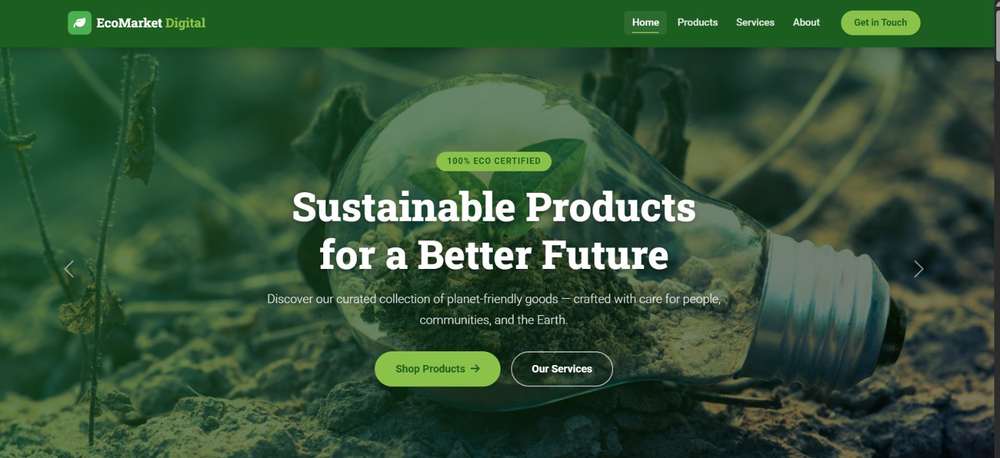

## Project Description

EcoMarket is a platform designed to promote sustainable and environmentally friendly products. Our goal is to provide an online shopping experience that encourages responsible consumption and supports local communities.

## Project Structure

The project is structured as follows:

```
eslint.config.js
index.html
package.json
postcss.config.js
README.md
script.js
styles.css
tailwind.config.js
tsconfig.app.json
tsconfig.json
tsconfig.node.json
vite.config.ts
src/
	App.tsx
	index.css
	main.tsx
	vite-env.d.ts
```

### Description of Main Files

- **index.html**: Main HTML file that serves as the entry point for the application.
- **script.js**: Main JavaScript file for the application logic.
- **styles.css**: Main CSS file for the application styles.
- **tailwind.config.js**: Tailwind CSS configuration.
- **tsconfig.json**: TypeScript configuration for the project.
- **vite.config.ts**: Vite bundler configuration.

#### `src` Folder

- **App.tsx**: Main application component.
- **index.css**: Base application styles.
- **main.tsx**: Application entry point in React.
- **vite-env.d.ts**: Type declarations for Vite.

## Technologies Used

- **React**: JavaScript library for building user interfaces.
- **TypeScript**: JavaScript superset that adds static typing.
- **Vite**: Fast build tool for modern web projects.
- **Tailwind CSS**: CSS framework for fast and efficient design.

## How to Run the Project

1. Clone this repository: `git clone <REPOSITORY_URL>`
2. Install dependencies: `npm install`
3. Start the development server: `npm run dev`
4. Open your browser at `http://localhost:3000` to see the application.

## Contributions

Contributions are welcome! If you wish to contribute, please open an issue or submit a pull request.

---

